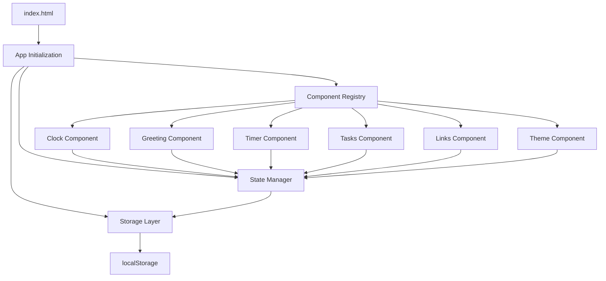
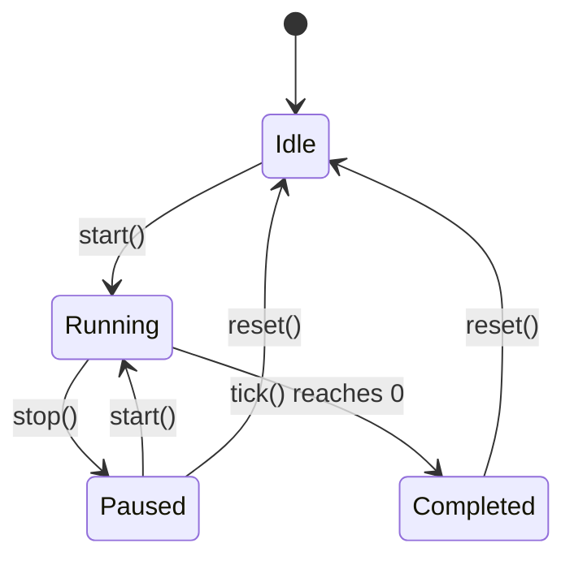

# Technical Design Document: To-Do List Life Dashboard

## Overview

The To-Do List Life Dashboard is a single-page web application that serves as a personal command center for productivity. Built with vanilla HTML, CSS, and JavaScript, it provides real-time clock display, time-based greetings, a Pomodoro timer, task management, and quick links—all in a dark editorial/neo-brutalist aesthetic.

### Key Design Principles

1. **Zero Dependencies**: Pure HTML/CSS/JS with no frameworks or libraries
2. **Local-First**: All data persisted to browser Local Storage
3. **Single-File Architecture**: One HTML file, one CSS file, one JS file
4. **Component Modularity**: Clear separation of concerns through JavaScript modules
5. **Aesthetic Consistency**: Dark editorial/neo-brutalist design language throughout

### Technology Stack

- **HTML5**: Semantic markup for structure
- **CSS3**: Custom properties (variables) for theming, Grid and Flexbox for layout
- **Vanilla JavaScript (ES6+)**: Modules, classes, localStorage API
- **Browser APIs**: setInterval for clock/timer, localStorage for persistence, Audio API for notifications

## Architecture

### Application Structure

```
todo-life-dashboard/
├── index.html           # Single HTML file with semantic structure
├── css/
│   └── style.css        # Single CSS file with all styles and themes
├── js/
│   └── app.js           # Single JavaScript file with all application logic
└── .kiro/
    └── specs/
        └── todo-life-dashboard/
            ├── requirements.md
            ├── design.md
            └── tasks.md
```

### Architecture Pattern

The application follows a **Component-based Module Pattern**:

1. **State Management**: Centralized state object managing all application data
2. **Component Modules**: Self-contained components (Clock, Timer, Tasks, etc.)
3. **Storage Layer**: Abstraction over localStorage for persistence
4. **Event System**: DOM events and custom event handlers for user interactions



### Data Flow

1. **Initialization**: Components load → State Manager restores from localStorage → Components render initial state
2. **User Interaction**: User action → Component handler → State update → localStorage sync → UI update
3. **Time-based Updates**: setInterval tick → Component update → UI render (no state change)

## Components and Interfaces

### 1. State Manager

**Responsibility**: Centralized application state management and persistence coordination

**Interface**:
```javascript
class StateManager {
  constructor(storage)
  
  // State access
  getState(key)
  setState(key, value)
  subscribe(key, callback)
  
  // Persistence
  loadState()
  saveState()
}
```

**State Schema**:
```javascript
{
  timer: {
    duration: 25,        // minutes
    isCustom: false,
    isRunning: false,
    remainingSeconds: 1500
  },
  tasks: [
    { id: string, description: string, completed: boolean, createdAt: number }
  ],
  links: [
    { id: string, name: string, url: string, createdAt: number }
  ],
  preferences: {
    theme: 'dark' | 'light',
    soundEnabled: true,
    userName: string | null
  }
}
```

### 2. Storage Layer

**Responsibility**: Abstract localStorage operations with error handling

**Interface**:
```javascript
class StorageService {
  static KEY = 'todoLifeDashboard'
  
  static load()      // Returns parsed state or default state
  static save(state) // Serializes and saves state
  static clear()     // Clears all stored data
}
```

**Error Handling**:
- Catches JSON parse errors and returns default state
- Handles localStorage quota exceeded errors
- Validates state schema on load

### 3. Clock Component

**Responsibility**: Display real-time clock in HH:MM:SS format (24-hour)

**Interface**:
```javascript
class ClockComponent {
  constructor(element)
  
  init()              // Start clock interval
  destroy()           // Clear interval
  render()            // Update DOM with current time
  getCurrentTime()    // Returns { hours, minutes, seconds }
}
```

**Implementation Details**:
- Uses `setInterval` with 1000ms interval
- Pads single digits with leading zeros
- Updates DOM efficiently (only when values change)

### 4. Greeting Component

**Responsibility**: Display date and time-appropriate greeting with optional user name

**Interface**:
```javascript
class GreetingComponent {
  constructor(element, stateManager)
  
  init()              // Subscribe to userName changes
  render()            // Update greeting text based on time
  getGreetingText()   // Returns greeting based on current hour
  getFormattedDate()  // Returns formatted date string
}
```

**Greeting Logic**:
- Morning (05:00-11:59): "Good morning"
- Afternoon (12:00-16:59): "Good afternoon"
- Evening (17:00-20:59): "Good evening"
- Night (21:00-04:59): "Good night"

### 5. Timer Component (Pomodoro)

**Responsibility**: Countdown timer with start/stop/reset controls and customizable duration

**Interface**:
```javascript
class TimerComponent {
  constructor(element, stateManager)
  
  init()              // Setup event listeners, restore state
  start()             // Begin countdown
  stop()              // Pause countdown
  reset()             // Reset to duration
  setDuration(minutes) // Update timer duration
  tick()              // Decrement second, check completion
  render()            // Update display MM:SS
  playNotification()  // Play sound when timer completes
}
```

**State Transitions**:


**Duration Options**:
- Preset: 15, 25, 45, 60 minutes
- Custom: user input (1-180 minutes)
- Duration changes disabled while timer running

### 6. Tasks Component

**Responsibility**: Task list management (CRUD operations) with persistence

**Interface**:
```javascript
class TasksComponent {
  constructor(element, stateManager)
  
  init()              // Render initial tasks
  addTask(description) // Create new task
  editTask(id, newDescription) // Update task description
  toggleTask(id)      // Toggle completion status
  deleteTask(id)      // Remove task
  isDuplicate(description) // Check for duplicate (case-insensitive)
  showDuplicateError() // Show visual feedback for 3 seconds
  render()            // Render full task list
}
```

**Task Operations**:
- Generate unique ID using timestamp + random string
- Maintain insertion order
- Animate completion toggle (500ms transition)
- Persist on every operation

### 7. Links Component (Quick Links)

**Responsibility**: Quick links management with persistence

**Interface**:
```javascript
class LinksComponent {
  constructor(element, stateManager)
  
  init()              // Render initial links
  addLink(name, url)  // Create new link
  deleteLink(id)      // Remove link
  validateUrl(url)    // Ensure URL is valid
  render()            // Render full links list
}
```

**URL Validation**:
- Check for non-empty name and URL
- Prepend `https://` if protocol missing
- Open links in new tab (`target="_blank"`)

### 8. Theme Component

**Responsibility**: Light/dark theme toggle with persistence

**Interface**:
```javascript
class ThemeComponent {
  constructor(element, stateManager)
  
  init()              // Apply saved theme, setup toggle
  toggleTheme()       // Switch between light/dark
  applyTheme(theme)   // Update CSS custom properties
}
```

**Theme Implementation**:
- CSS custom properties for all colors
- Toggle updates `data-theme` attribute on document root
- Smooth transitions using CSS (300ms)

### Component Communication

Components communicate through the State Manager:

1. **Direct State Updates**: Component → StateManager.setState() → localStorage sync
2. **Subscriptions**: Component subscribes to state keys → receives callbacks on changes
3. **No Direct DOM Access**: Components only manipulate their own element subtrees

## Data Models

### Task Model

```typescript
interface Task {
  id: string;           // Unique identifier (timestamp + random)
  description: string;  // Task text
  completed: boolean;   // Completion status
  createdAt: number;    // Unix timestamp
}
```

**Constraints**:
- `description`: Non-empty string, max 500 characters
- `id`: Must be unique across all tasks
- `createdAt`: Used for ordering tasks

### Link Model

```typescript
interface Link {
  id: string;           // Unique identifier (timestamp + random)
  name: string;         // Display name
  url: string;          // Target URL (validated)
  createdAt: number;    // Unix timestamp
}
```

**Constraints**:
- `name`: Non-empty string, max 100 characters
- `url`: Valid URL format, auto-prepend protocol if missing
- `id`: Must be unique across all links

### Timer State Model

```typescript
interface TimerState {
  duration: number;         // Duration in minutes (15, 25, 45, 60, or custom)
  isCustom: boolean;        // Whether using custom duration
  isRunning: boolean;       // Timer active state
  remainingSeconds: number; // Countdown value in seconds
}
```

**Constraints**:
- `duration`: Integer between 1 and 180
- `remainingSeconds`: Non-negative integer
- When `isRunning` is true, duration changes are blocked

### Preferences Model

```typescript
interface Preferences {
  theme: 'dark' | 'light';
  soundEnabled: boolean;
  userName: string | null;
}
```

**Defaults**:
- `theme`: 'dark'
- `soundEnabled`: true
- `userName`: null (show generic greeting)

## Error Handling

### localStorage Errors

**Quota Exceeded**:
```javascript
try {
  localStorage.setItem(key, value);
} catch (e) {
  if (e.name === 'QuotaExceededError') {
    // Notify user storage is full
    // Attempt to clear old data or reduce storage
    console.error('Storage quota exceeded');
  }
}
```

**Handling Strategy**:
- Catch and log errors gracefully
- Continue operation with in-memory state
- Display user-friendly error message
- Provide option to clear all data and restart

### JSON Parse Errors

**Invalid Data**:
```javascript
try {
  const state = JSON.parse(localStorage.getItem(key));
} catch (e) {
  // Return default state if parse fails
  console.error('Failed to parse stored state, using defaults');
  return getDefaultState();
}
```

**Handling Strategy**:
- Always validate parsed data structure
- Fall back to default state on parse failure
- Log error for debugging
- Don't crash the application

### Timer Edge Cases

**Negative Time**: 
- Guard against negative remainingSeconds
- Clamp to 0 if negative value detected
- Automatically stop timer at 0

**Duration Limits**:
- Enforce minimum duration: 1 minute
- Enforce maximum duration: 180 minutes (3 hours)
- Validate custom input before applying

**State Inconsistency**:
- If timer state is `isRunning: true` but `remainingSeconds: 0`, reset to idle
- On page load, always reset timer to idle state (don't resume running timer)

### Task and Link Input Validation

**Empty Input**:
```javascript
function validateTaskDescription(desc) {
  if (!desc || desc.trim().length === 0) {
    return { valid: false, error: 'Description cannot be empty' };
  }
  if (desc.length > 500) {
    return { valid: false, error: 'Description too long (max 500 characters)' };
  }
  return { valid: true };
}
```

**URL Validation**:
```javascript
function validateUrl(url) {
  if (!url || url.trim().length === 0) {
    return { valid: false, error: 'URL cannot be empty' };
  }
  
  // Auto-prepend protocol if missing
  let normalizedUrl = url;
  if (!/^https?:\/\//i.test(url)) {
    normalizedUrl = 'https://' + url;
  }
  
  // Basic URL format check
  try {
    new URL(normalizedUrl);
    return { valid: true, url: normalizedUrl };
  } catch (e) {
    return { valid: false, error: 'Invalid URL format' };
  }
}
```

**Duplicate Detection**:
- Normalize descriptions (trim, lowercase) before comparison
- Show error feedback for 3 seconds
- Prevent form submission on duplicate

### Audio Playback Errors

**Sound File Loading**:
```javascript
const audio = new Audio('notification.mp3');
audio.addEventListener('error', (e) => {
  console.error('Failed to load notification sound');
  // Silently fail, don't block timer functionality
});
```

**Autoplay Restrictions**:
- Modern browsers may block autoplay
- Use user interaction (start timer) as trigger
- Fall back gracefully if sound fails to play
- Don't throw errors that break timer

### Interval Cleanup

**Memory Leaks**:
- Always clear intervals on component destroy
- Clear intervals before setting new ones
- Track interval IDs in component state

```javascript
class TimerComponent {
  constructor() {
    this.intervalId = null;
  }
  
  start() {
    if (this.intervalId) {
      clearInterval(this.intervalId);
    }
    this.intervalId = setInterval(() => this.tick(), 1000);
  }
  
  destroy() {
    if (this.intervalId) {
      clearInterval(this.intervalId);
      this.intervalId = null;
    }
  }
}
```

## Testing Strategy

### Why Property-Based Testing Is Not Appropriate

This application is **not suitable for property-based testing** because:

1. **UI-Heavy Architecture**: The core functionality involves DOM manipulation, event handling, and rendering—these are side effects, not pure functions
2. **Browser API Integration**: Heavy reliance on localStorage, setInterval, Audio API, which are external dependencies with side effects
3. **Simple Utility Logic**: While there are pure functions (time formatting, string matching), they are trivial and well-covered by example-based tests
4. **State Management Focus**: The complexity lies in coordinating state changes across components and persisting to storage, not in algorithmic correctness

**What testing approaches ARE appropriate:**
- **Unit Tests**: For utility functions, component methods, and state management logic
- **Integration Tests**: For localStorage persistence, timer behavior, and component coordination
- **UI Tests**: For DOM rendering, event handling, and user interaction flows
- **Manual Testing**: For visual design compliance, animations, and cross-browser compatibility

### Testing Approach

#### 1. Unit Tests (Jest or similar)

**Utility Functions**:
```javascript
describe('Time Formatting', () => {
  test('formats single digits with leading zeros', () => {
    expect(formatTime(5, 3, 7)).toBe('05:03:07');
  });
  
  test('formats double digits without padding', () => {
    expect(formatTime(15, 23, 47)).toBe('15:23:47');
  });
  
  test('handles midnight correctly', () => {
    expect(formatTime(0, 0, 0)).toBe('00:00:00');
  });
});

describe('Greeting Selection', () => {
  test('returns morning greeting between 5am and 11:59am', () => {
    expect(getGreeting(5)).toContain('morning');
    expect(getGreeting(11)).toContain('morning');
  });
  
  test('returns afternoon greeting between 12pm and 4:59pm', () => {
    expect(getGreeting(12)).toContain('afternoon');
    expect(getGreeting(16)).toContain('afternoon');
  });
  
  test('returns evening greeting between 5pm and 8:59pm', () => {
    expect(getGreeting(17)).toContain('evening');
    expect(getGreeting(20)).toContain('evening');
  });
  
  test('returns night greeting between 9pm and 4:59am', () => {
    expect(getGreeting(21)).toContain('night');
    expect(getGreeting(3)).toContain('night');
  });
});

describe('Duplicate Detection', () => {
  test('detects exact duplicates', () => {
    const tasks = [{ description: 'Buy milk' }];
    expect(isDuplicate('Buy milk', tasks)).toBe(true);
  });
  
  test('detects case-insensitive duplicates', () => {
    const tasks = [{ description: 'Buy milk' }];
    expect(isDuplicate('buy MILK', tasks)).toBe(true);
    expect(isDuplicate('BUY MILK', tasks)).toBe(true);
  });
  
  test('ignores whitespace differences', () => {
    const tasks = [{ description: 'Buy milk' }];
    expect(isDuplicate('  Buy milk  ', tasks)).toBe(true);
  });
  
  test('allows non-duplicates', () => {
    const tasks = [{ description: 'Buy milk' }];
    expect(isDuplicate('Buy eggs', tasks)).toBe(false);
  });
});
```

**State Management**:
```javascript
describe('StateManager', () => {
  let state;
  
  beforeEach(() => {
    state = new StateManager(new MockStorage());
  });
  
  test('initializes with default state', () => {
    expect(state.getState('preferences').theme).toBe('dark');
  });
  
  test('updates state and triggers subscribers', () => {
    const callback = jest.fn();
    state.subscribe('tasks', callback);
    
    state.setState('tasks', [{ id: '1', description: 'Test' }]);
    
    expect(callback).toHaveBeenCalledWith([{ id: '1', description: 'Test' }]);
  });
  
  test('persists state changes to storage', () => {
    const storage = new MockStorage();
    const state = new StateManager(storage);
    
    state.setState('preferences', { theme: 'light' });
    
    expect(storage.save).toHaveBeenCalled();
  });
});
```

#### 2. Component Integration Tests

**Timer Component**:
```javascript
describe('TimerComponent', () => {
  let timer;
  let mockState;
  
  beforeEach(() => {
    mockState = createMockStateManager();
    timer = new TimerComponent(document.createElement('div'), mockState);
    jest.useFakeTimers();
  });
  
  test('starts countdown from duration', () => {
    mockState.setState('timer', { duration: 25, remainingSeconds: 1500 });
    timer.start();
    
    jest.advanceTimersByTime(1000);
    
    expect(mockState.getState('timer').remainingSeconds).toBe(1499);
  });
  
  test('stops at zero and plays notification', () => {
    mockState.setState('timer', { duration: 25, remainingSeconds: 1 });
    const playNotification = jest.spyOn(timer, 'playNotification');
    
    timer.start();
    jest.advanceTimersByTime(1000);
    
    expect(mockState.getState('timer').remainingSeconds).toBe(0);
    expect(mockState.getState('timer').isRunning).toBe(false);
    expect(playNotification).toHaveBeenCalled();
  });
  
  test('resets to duration', () => {
    mockState.setState('timer', { duration: 25, remainingSeconds: 900 });
    timer.reset();
    
    expect(mockState.getState('timer').remainingSeconds).toBe(1500);
  });
  
  test('prevents duration change while running', () => {
    mockState.setState('timer', { duration: 25, isRunning: true });
    
    expect(() => timer.setDuration(45)).toThrow();
  });
});
```

**Tasks Component**:
```javascript
describe('TasksComponent', () => {
  let tasks;
  let mockState;
  
  beforeEach(() => {
    mockState = createMockStateManager();
    tasks = new TasksComponent(document.createElement('div'), mockState);
  });
  
  test('adds new task', () => {
    tasks.addTask('Buy milk');
    
    const taskList = mockState.getState('tasks');
    expect(taskList).toHaveLength(1);
    expect(taskList[0].description).toBe('Buy milk');
    expect(taskList[0].completed).toBe(false);
  });
  
  test('prevents duplicate tasks', () => {
    tasks.addTask('Buy milk');
    tasks.addTask('buy MILK');
    
    expect(mockState.getState('tasks')).toHaveLength(1);
  });
  
  test('toggles task completion', () => {
    tasks.addTask('Buy milk');
    const taskId = mockState.getState('tasks')[0].id;
    
    tasks.toggleTask(taskId);
    expect(mockState.getState('tasks')[0].completed).toBe(true);
    
    tasks.toggleTask(taskId);
    expect(mockState.getState('tasks')[0].completed).toBe(false);
  });
  
  test('deletes task', () => {
    tasks.addTask('Buy milk');
    const taskId = mockState.getState('tasks')[0].id;
    
    tasks.deleteTask(taskId);
    
    expect(mockState.getState('tasks')).toHaveLength(0);
  });
  
  test('maintains creation order', () => {
    tasks.addTask('Task 1');
    tasks.addTask('Task 2');
    tasks.addTask('Task 3');
    
    const taskList = mockState.getState('tasks');
    expect(taskList[0].description).toBe('Task 1');
    expect(taskList[1].description).toBe('Task 2');
    expect(taskList[2].description).toBe('Task 3');
  });
});
```

#### 3. localStorage Integration Tests

```javascript
describe('StorageService', () => {
  beforeEach(() => {
    localStorage.clear();
  });
  
  test('saves and loads state', () => {
    const state = { tasks: [{ id: '1', description: 'Test' }] };
    StorageService.save(state);
    
    const loaded = StorageService.load();
    expect(loaded.tasks).toEqual(state.tasks);
  });
  
  test('returns default state on parse error', () => {
    localStorage.setItem(StorageService.KEY, 'invalid json');
    
    const loaded = StorageService.load();
    expect(loaded.tasks).toEqual([]);
  });
  
  test('handles quota exceeded gracefully', () => {
    // Mock localStorage to throw quota error
    const mockSetItem = jest.spyOn(Storage.prototype, 'setItem')
      .mockImplementation(() => {
        throw new DOMException('QuotaExceededError');
      });
    
    expect(() => StorageService.save({ huge: 'data' })).not.toThrow();
    
    mockSetItem.mockRestore();
  });
});
```

#### 4. End-to-End UI Tests (Playwright/Cypress)

```javascript
describe('Dashboard E2E', () => {
  beforeEach(() => {
    cy.visit('/');
  });
  
  test('displays clock that updates', () => {
    cy.get('[data-testid="clock"]').should('exist');
    cy.get('[data-testid="clock"]').invoke('text').as('initialTime');
    
    cy.wait(1000);
    
    cy.get('[data-testid="clock"]').invoke('text').should('not.equal', '@initialTime');
  });
  
  test('starts and stops timer', () => {
    cy.get('[data-testid="timer-start"]').click();
    cy.get('[data-testid="timer-display"]').should('not.contain', '25:00');
    
    cy.get('[data-testid="timer-stop"]').click();
    cy.get('[data-testid="timer-display"]').invoke('text').as('pausedTime');
    
    cy.wait(1000);
    cy.get('[data-testid="timer-display"]').should('contain', '@pausedTime');
  });
  
  test('adds and completes tasks', () => {
    cy.get('[data-testid="task-input"]').type('Buy milk');
    cy.get('[data-testid="task-add"]').click();
    
    cy.get('[data-testid="task-list"]').should('contain', 'Buy milk');
    
    cy.get('[data-testid="task-toggle"]').first().click();
    cy.get('[data-testid="task-list"] li').first().should('have.class', 'completed');
  });
  
  test('persists data on reload', () => {
    cy.get('[data-testid="task-input"]').type('Buy milk');
    cy.get('[data-testid="task-add"]').click();
    
    cy.reload();
    
    cy.get('[data-testid="task-list"]').should('contain', 'Buy milk');
  });
  
  test('toggles theme', () => {
    cy.get('html').should('have.attr', 'data-theme', 'dark');
    
    cy.get('[data-testid="theme-toggle"]').click();
    
    cy.get('html').should('have.attr', 'data-theme', 'light');
  });
});
```

#### 5. Manual Testing Checklist

**Visual Design**:
- [ ] Clock and timer use bold, large typography
- [ ] All borders are hard (1-2px solid)
- [ ] Color contrast is sharp (no gradients)
- [ ] Hard shadows applied to elevated elements
- [ ] Hero section (greeting + clock) is visually prominent
- [ ] Two-column grid layout for timer and tasks
- [ ] Quick links displayed below main grid

**Interactions**:
- [ ] Hover states visible on all interactive elements
- [ ] Focus states meet accessibility requirements
- [ ] Task completion animates smoothly (500ms)
- [ ] Theme transition is smooth (300ms)
- [ ] Duplicate task error shows for 3 seconds

**Browser Compatibility**:
- [ ] Chrome: All features working
- [ ] Firefox: All features working
- [ ] Edge: All features working
- [ ] Safari: All features working

**Performance**:
- [ ] Initial load under 1 second
- [ ] Interactions respond under 100ms
- [ ] Timer updates smoothly without lag
- [ ] Task list updates smoothly with 100+ tasks

### Test Coverage Goals

- **Unit Tests**: 80%+ coverage of utility functions and state management
- **Integration Tests**: All component interactions and localStorage operations
- **E2E Tests**: Critical user flows (add task, run timer, toggle theme)
- **Manual Tests**: Visual design compliance and cross-browser compatibility

### Testing Tools

- **Unit/Integration**: Jest + DOM Testing Library
- **E2E**: Playwright or Cypress
- **Accessibility**: axe-core for automated a11y checks
- **Performance**: Lighthouse CI for performance regression detection

